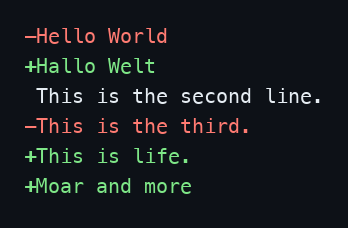
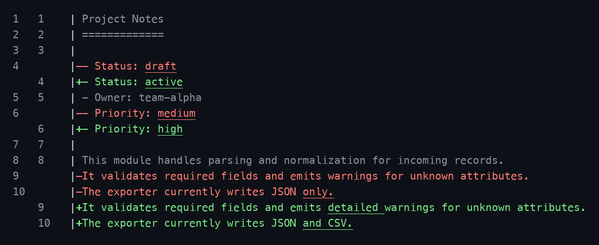

# Example output gallery

Run these commands from the repository root. The file based examples below use
the same [before](diffs/case01.01.before_simple_edit.txt) and
[after](diffs/case01.02.after_simple_edit.txt) inputs, so their output formats
are easy to compare. The images render the examples' actual colored terminal
output; the text below each image is available to copy or read without color.

## Colored line diff

[Source](terminal.rs) · Run: `cargo run --example terminal`

`terminal` marks removed and added lines in red and green. Its input strings
are defined in the source file.



```diff
-Hello World
+Hallo Welt
 This is the second line.
-This is the third.
+This is life.
+Moar and more
```

## Colored inline diff

[Source](terminal-inline.rs) · Run:
`cargo run --example terminal-inline --features inline,bytes -- examples/diffs/case01.01.before_simple_edit.txt examples/diffs/case01.02.after_simple_edit.txt`

`terminal-inline` adds old and new line numbers and underlines changed text
within each line. Its `inline` and `bytes` features are required by the
example.



<details>
<summary>Text output</summary>

```text
1   1    | Project Notes
2   2    | =============
3   3    |
4        |-- Status: draft
    4    |+- Status: active
5   5    | - Owner: team-alpha
6        |-- Priority: medium
    6    |+- Priority: high
7   7    |
8   8    | This module handles parsing and normalization for incoming records.
9        |-It validates required fields and emits warnings for unknown attributes.
10       |-The exporter currently writes JSON only.
    9    |+It validates required fields and emits detailed warnings for unknown attributes.
    10   |+The exporter currently writes JSON and CSV.
```

</details>

## Unified diff

[Source](udiff.rs) · Run:
`cargo run --example udiff --features bytes -- examples/diffs/case01.01.before_simple_edit.txt examples/diffs/case01.02.after_simple_edit.txt`

`udiff` writes a plain unified diff with file headers and a hunk range.
The `bytes` feature is required by this example.

```diff
--- examples/diffs/case01.01.before_simple_edit.txt
+++ examples/diffs/case01.02.after_simple_edit.txt
@@ -1,10 +1,10 @@
 Project Notes
 =============

-- Status: draft
+- Status: active
 - Owner: team-alpha
-- Priority: medium
+- Priority: high

 This module handles parsing and normalization for incoming records.
-It validates required fields and emits warnings for unknown attributes.
-The exporter currently writes JSON only.
+It validates required fields and emits detailed warnings for unknown attributes.
+The exporter currently writes JSON and CSV.
```

## Close matches

[Source](close-matches.rs) · Run: `cargo run --example close-matches`

`close-matches` returns similar words from an in-source list.

```text
["appu", "appal", "apple"]
["beeb", "beer"]
```

## Non-string slices

[Source](nonstring.rs) · Run: `cargo run --example nonstring`

`nonstring` diffs integer slices and prints each change with its indexes.

```text
Change { tag: Equal, old_index: Some(0), new_index: Some(0), value: 1 }
Change { tag: Equal, old_index: Some(1), new_index: Some(1), value: 2 }
Change { tag: Delete, old_index: Some(2), new_index: None, value: 3 }
Change { tag: Insert, old_index: None, new_index: Some(2), value: 4 }
```

The [remaining example sources](.) cover Patience diffs, whitespace handling,
serialized changes, computed or bucketed sequences, and larger inputs. The
[benchmarks](../benches/README.md) and [performance fuzzer](../fuzz/README.md)
are measurement tools rather than output formats.
